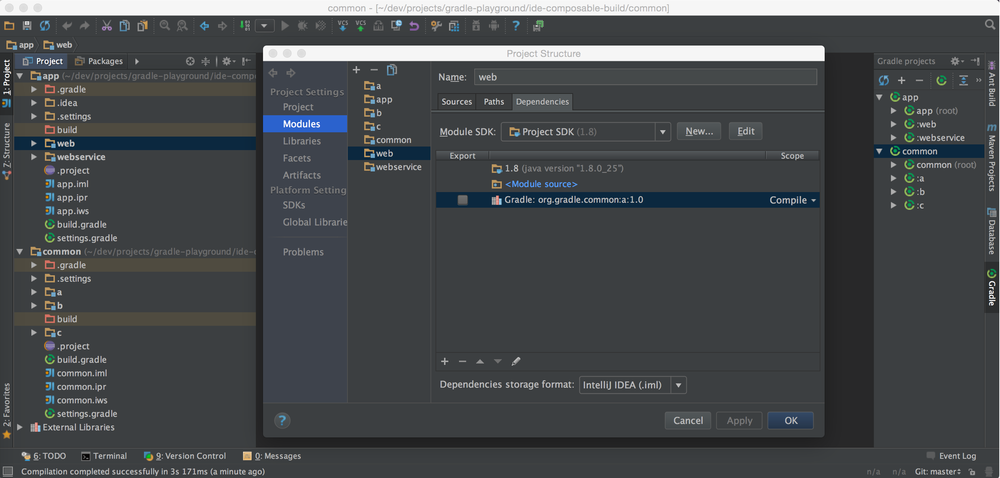
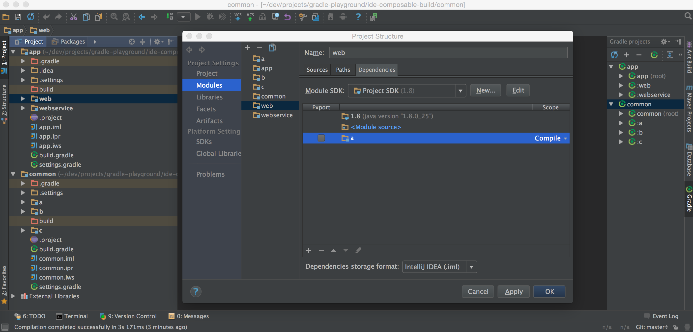
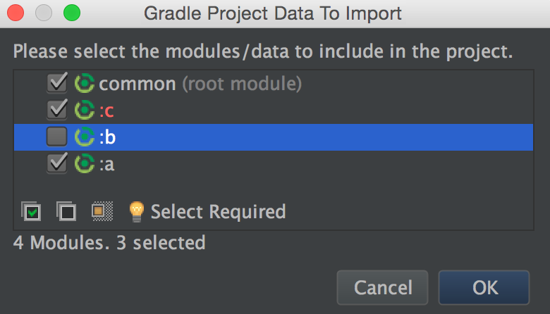
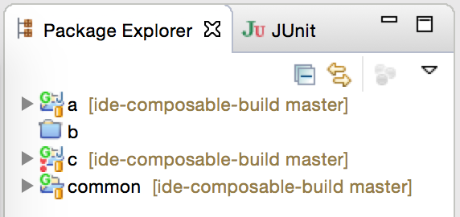

# IDE dependency substitution

The purpose of this repository is to analyze the user actions to substitute a binary dependency with source dependency or vice versa. The steps required are independent from the underlying build infrastructure. All actions are performed manually to identify the capabilities of the IDE. Two IDEs are analyzed: IDEA IntelliJ and Eclipse/Buildship.

For this experiment we use two multi-project builds: `common` and `web`.

The project `common` provides reusable logic in three subprojects: `a`, `b` and `c`. The subproject `c` has a source dependency on `a` and `b`. The subprojects `a`, `b` and `c` produce artifacts that are published to a repository alongside the projects. 

The project `web` consumes the published artifacts of `common` in the subprojects `web` and `webservice`. The dependency on `a` and `b` are specified as binary dependencies. Both multi-project builds, `common` and `web` are decoupled from each other and are buildable independently.

For this experiment there are two goals:

1. Build `common` and `web` in the same workspace. Replace a binary dependency with a source dependency.
2. Build only one of the multi-project builds e.g. `common`. Replace a source dependency with a binary dependency.

## Replacing a binary dependency with source dependency

### IntelliJ

IntelliJ does not have a concept of a workspace. However, one can open multiple projects in the same Window of IntelliJ.

1. Import project `common` by selecting "Import Project". Select the `build.gradle` file of in the dialog. Use the default settings in the Gradle import dialog. All projects of the multi-project build should be preselected for import. Press OK. The "project view" renders the `common` projects with all it's subprojects.
2. From the menu bar select "File" > "New" > "Module from existing sources...", point to the `build.gradle` file of `app`. All projects of the multi-project build should be preselected for import. Press OK. The "project view" renders the `app` projects with all it's subprojects alongside the `common` projects.
3. The modules as a whole should be compilable via "Build" > "Rebuild project". Binary dependencies are required to be published to work properly.
4. Select the `app` module and "Open Module Settings" from the context menu. In the "Modules" tab select the `web` module. The `web` module has a dependency on `org.gradle.common:a:1.0`. To replace this binary dependency with a source dependency press the "+" button and select "Module Dependency...". Select module `a` from the list and remove the binary dependency by selecting it and pressing the "-" button.
5. To verify, delete the binary repository on local disk. The subsitution could be performed for `b` as well.

#### Before

#### After

### Buildship

1. From the menu bar select "File" > "Import...". Select "Gradle Project". Import project `common`. The projects should be rendered in the package explorer as flat hierarchy.
2. From the menu bar select "File" > "Import...". Select "Gradle Project". Import project `web`. The projects should be rendered in the package explorer as flat hierarchy.
3. After the import no issues should be reported.
4. Select the `web` project. From the context menu select "Properties". In the tab "Libraries", the dependency `a-1.0.jar` should be shown as entry in the classpath container.

__At the moment it seems like a classpath container cannot be modified e.g. remove binary dependencies or add source dependencies. It would have to be done outside of the classpath container which we most certainly don't want to do.__

## Replacing a source dependency with binary dependency

### IntelliJ

1.  Import project `common` by selecting "Import Project". Select the `build.gradle` file of in the dialog. In the dialog "Gradle Project Data to Import" deselect `b`. Press OK. The project should contain the modules `a` and `c` but not `b`. The module `c` should report a compilation issues as it cannot find the class from module `b`.
2. Select the `c` module and "Open Module Settings" from the context menu. Remove the module dependency on `b`.

#### Selecting a subset of projects

__At the moment it seems like there's no way to add a binary dependency based on coordinates for a Gradle project. Binary Gradle dependencies aren't even listed in the .iml file.__

### Buildship

1. From the menu bar select "File" > "Import...". Select "Gradle Project". Import project `common`. The projects should be rendered in the project view as flat hierarchy.
2. In the package explorer select project `b`, open the context dialog and select the option "Close Project". The module `c` should report a compilation issues as it cannot find the class from module `b`.

#### Selecting a subset of projects

__At the moment it seems like a classpath container cannot be modified e.g. remove source dependencies or add binary dependencies. It would have to be done outside of the classpath container which we most certainly don't want to do.__